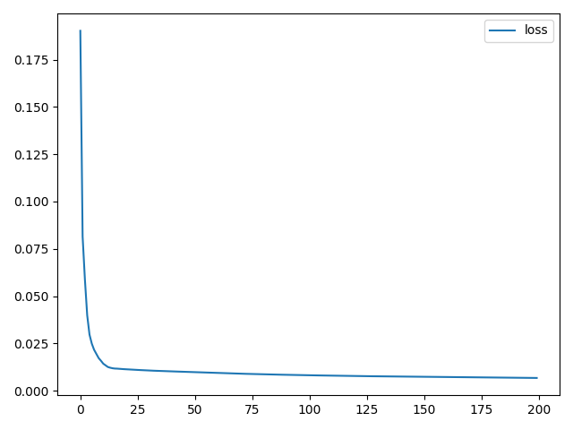

## 测试表格

- 10次取平均

|  id  |  LR  |batch_size|hidden_size| num_layers | epoch |    r2    |   DA   |           conclusion           |
|:----:|:----:|  :----:  |   :----:  |   :----:   |:----: |  :----:  | :----: |             :----:             |
|  01  |0.0010|    20    |    128    |     1      |  200  |    --    |   --   |       loss不收敛，调整LR看看      |
|★ 02 |0.0005|    20    |    128    |     1      |  200  |  0.7482  | 0.6768 |          调整epoch看看           |
|  03  |0.0005|    20    |    128    |     1      |  250  |  0.7050  | 0.6869 |               --               |
|  04  |0.0005|    20    |    128    |     1      |  300  |  0.6957  | 0.6778 |               --               |
|  05  |0.0005|    20    |    128    |     1      |  100  |  0.6676  | 0.6707 |               --               |
|  06  |0.0005|    20    |    128    |     1      |  150  |  0.7045  | 0.6818 |         目前200epoch最佳        |
---
|  id  |  LR  |batch_size|hidden_size| num_layers | epoch |    r2    |   DA   |           conclusion           |
|:----:|:----:|  :----:  |   :----:  |   :----:   |:----: |  :----:  | :----: |             :----:             |
|  07  |0.0005|    40    |    128    |     1      |  200  |  0.2774  | 0.6475 |      不稳定，调整batch_size看看   |
|  08  |0.0005|    60    |    128    |     1      |  200  |  0.6304  | 0.7141 |              --                |
|★ 09 |0.0005|    80    |    128    |     1      |  200  |  0.7862  | 0.7172 |              --                |
|  10  |0.0005|   100    |    128    |     1      |  200  |  0.7906  | 0.7374 |              --                |
|  11  |0.0005|   120    |    128    |     1      |  200  |  0.7714  | 0.7444 |              --                |
|  12  |0.0005|   140    |    128    |     1      |  200  |  0.7735  | 0.7394 |              --                |
|  13  |0.0005|   160    |    128    |     1      |  200  |  0.7742  | 0.7475 |              --                |
|  14  |0.0005|   180    |    128    |     1      |  200  |  0.7003  | 0.7162 |              --                |
|  15  |0.0005|   200    |    128    |     1      |  200  |  0.6864  | 0.7141 |        目前80batch_size最佳     |
---
|  id  |  LR  |batch_size|hidden_size| num_layers | epoch |    r2    |   DA   |           conclusion           |
|:----:|:----:|  :----:  |   :----:  |   :----:   |:----: |  :----:  | :----: |             :----:             |
|  16  |0.0005|    80    |    32     |     1      |  200  |  0.7513  | 0.7374 |              --                |
|  17  |0.0005|    80    |    64     |     1      |  200  |  0.7708  | 0.7152 |              --                |
|  18  |0.0005|    80    |    256    |     1      |  200  |  0.7765  | 0.7455 |              --                |
|  19  |0.0005|    80    |    32     |     2      |  200  |  0.7697  | 0.7111 |              --                |
|  20  |0.0005|    80    |    64     |     2      |  200  |  0.7360  | 0.7162 |              --                |
|  21  |0.0005|    80    |    128    |     2      |  200  |  0.6416  | 0.6758 |              --                |
|  22  |0.0005|    80    |    256    |     2      |  200  |  0.7546  | 0.7273 |        加深一个layer无提升       |

- 50次取平均

|  id  |  LR  |batch_size|hidden_size| num_layers | epoch |    r2    |   DA   |           conclusion           |
|★ 23 |0.0005|    20    |    128    |     1      |  200  |  0.  | 0. |              --                |
|★ 24 |0.0005|    80    |    128    |     1      |  200  |  0.  | 0. |              --                |

## 测试图片

### 02_loss 

